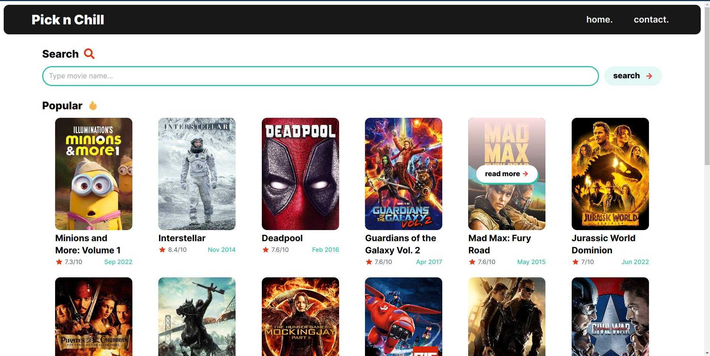
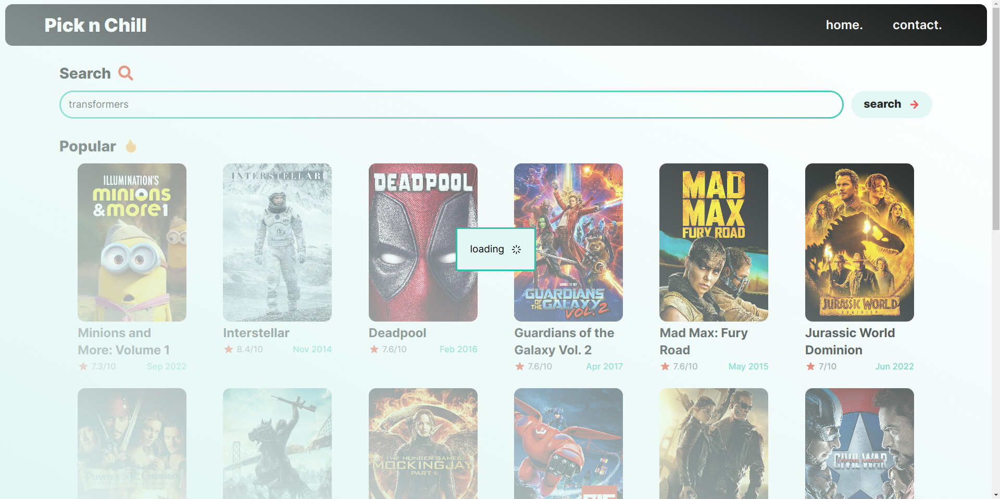
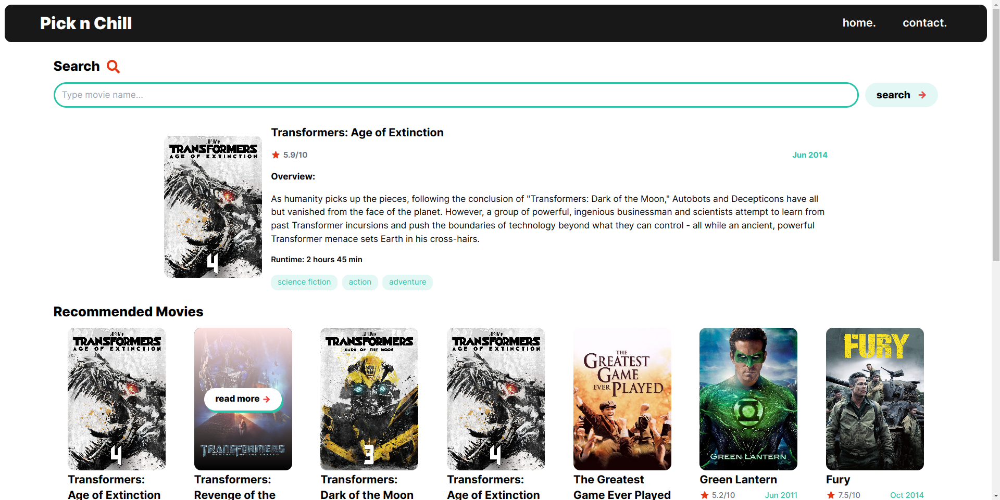
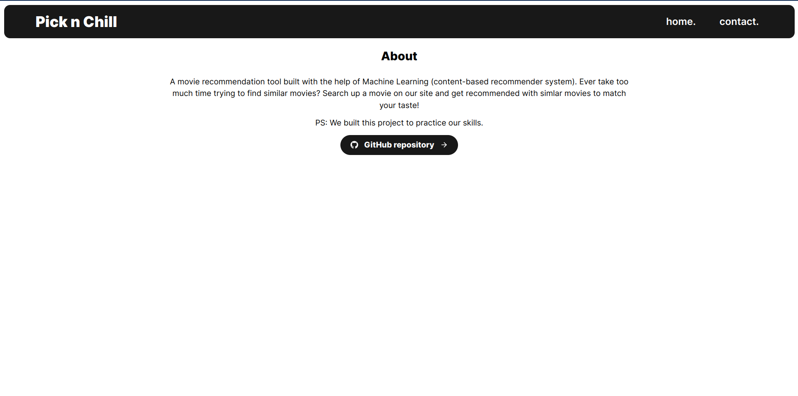

# pick-n-chill

> 🎥 Movie recommendation tool

A **movie recommendation** tool built with the help of Machine Learning (content-based recommender system). Ever take too much time trying to find similar movies? Search up a movie on our site and get recommended with simlar movies to match your taste!

PS: We built this project to practice our skills.

## Table of Contents

- [Team](#team)
- [Tech Stack](#teck-stack)
- [Setup Locally](#setup-locally)
  - [Backend server](#for-the-ml-model-and-node-server)
  - [Frontend](#client)
- [Screenshots](#screenshots)
- [License](#license)

## Team

- [@hk2257853](https://github.com/hk2257853): Backend
- [@Greeshma2903](https://github.com/greeshma2903): Design, Frontend
- [@Pratham-cymk](https://www.github.com/Pratham-cymk): Machine Learning

## Tech Stack

- Client: React, WindiCSS, React Router
- Server: Node, Express
- ML Model: Numpy, Pandas (Python)

### API Used

- The Movie Database: https://developers.themoviedb.org/3/getting-started/introduction

## Setup Locally

> - Run the commands in your terminal/command line.
> - Requirements: python3, pip, npm (nodejs)

1. Clone or download the repo on your local system, and navigate to the project directory.

   ```bash
   git clone https://github.com/Greeshma2903/movie-recommendation-system.git && cd movie-recommendation-system
   ```
### For the ML Model and Node server


2. Navigate to `server` directory
   ```bash
   cd 'server'
   ```
3. Setup the virtual environment to install the python packages

   > Virtualenv is a tool to set up your Python environments. ([read this for installation](https://www.freecodecamp.org/news/how-to-setup-virtual-environments-in-python/))

   ```bash
   # install virtual environment to your host python, if you haven't already:
      # pip install virtualenv
      # OR
      # python -m pip install virtualenv

   # use the virtual env
   python<version> -m venv env
   # example
   python3 -m venv env
   ```

   To activate the virual environment:

   ```bash
   # on mac or linux
   source env/bin/activate

   # on windows
   env/Scripts/activate.bat # in CMD line
   env/Scripts/Activate.ps1 # in Powershell
   ```

4. Install all the libraries mentioned in the `requirements.txt` file with the command:

   ```bash
   pip install -r requirements.txt

   # OR
   python -m pip install -r requirements.txt
   ```

5. Dectivate the environment after you're done with your work:

   ```bash
   deactivate
   ```

6. For the project to work, you need get your API key from [TMDB's website](https://www.themoviedb.org/documentation/api), and store it in a `.env` file in the `server` folder.

   ```bash
   # .env file
   API_KEY=###
   ```

7. To run the node server
   ```bash
   npm install
   npm start
   ```

### Client

1. Go to the project directory

   ```bash
   cd client
   ```

2. Install dependencies
   ```bash
   npm install
   ```
3. Run the server at localhost
   ```bash
   npm run dev
   ```

## Screenshots

<details>
<summary>click here</summary>






</details>

## License

[MIT](https://choosealicense.com/licenses/mit/)
